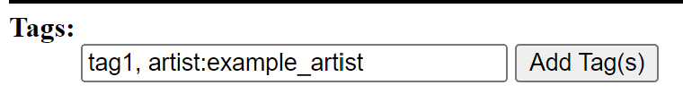
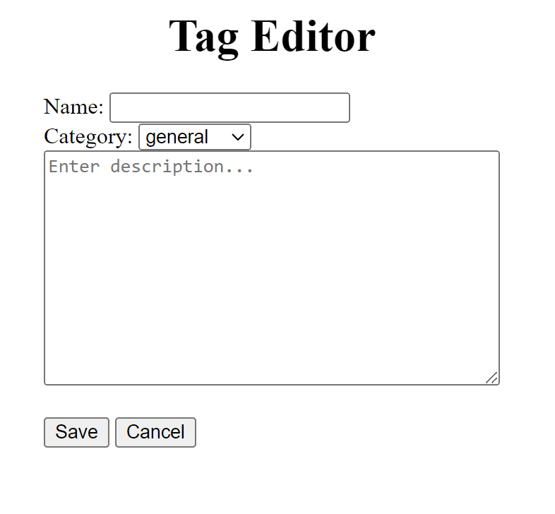

# Boardy2
Boardy2 is a flask-based image gallery app.

If you are more comfortable running the project through a desktop, go checkout [Boardy3](https://github.com/disbxys/boardy3) for more information.

## Dependencies
```
Python
python-magic
Flask
Flask-SQLAlchemy
opencv-python
``````

### Missing Libmagic
There is a good chance that you will run into this error

```
File "C:\Users\default\AppData\Roaming\Python\Python3\site-packages\magic\loader.py", line 49, in load_lib
    raise ImportError('failed to find libmagic.  Check your installation')
ImportError: failed to find libmagic.  Check your installation
```

if you either tried running something like
```
pip install python-magic python-magic-bin
```
or you forgot to install `python-magic-bin`. For some reason, it really likes to be a pain in the butt to work with.

#### Windows

You can fetch the DLLs for Windows for libmagic kinly provided by **@julian-r** by running
```
pip install python-magic-bin
```

Make sure to have this installed **AFTER** installing `python-magic`. Otherwise, you can run into the same error.

#### Other Platforms
Refer to https://github.com/ahupp/python-magic#installation for more information

## How to Run
This program is run through a web browser by running `launch.py`.

By default, the app will only be available on the local machine. To host it on the local network, modify the following line in `launch.py`:
```python
app.run()
```
to include the following arguments
```python
app.run(host="0.0.0.0", port="5000")
```
where `host="0.0.0.0"` means hosting the app on the local network and `port="5000"` is which port to access the app.

When launched this way, the app would be available at http://localhost:5000 or http://127.0.0.1:5000.

*Note: By default, the `host` and `port` arguments will be the same as in the example above. You can leave the line as-is unless you plan to host the app somewhere else.*

## Supported Media Formats
Boardy2 supports most image/video formats. Please refer to [python-magic](#python-magic) for specifics.

### Python-Magic
As the app uses python-magic to determine image file formats and mimetypes, any failure to detect an image format will most likely be due to python-magic.

## Tagging Images
Tags are separated into 5 categories:
- **Copyright:** What series do the characters shown in the image appear in.
- **Character:** What characters are shown in the image.
- **Artist:** Who created the image. This should be the person that created the image itself and not the actual creator of the characters (if any) shown in the image.
- **Metadata:** Any information about the image itself (e.g. ai generated, video, etc...).
- **General:** Any tags that do not fall under the above categories go here. This is usually where most tags would default to.

There are 2 ways of creating tags.

### Quick Adding


New tags can be created here. The format for creating new tags is `CATEGORY:TAGNAME`. The category can be omitted, but a tag name **MUST** be provided. If a category is not provided, the tag will have the general category by default.

Multiple tags can also be added by separating them with a comma.

### Manual Adding


You can create tags one at a time by navigating to the "Tags" page at the top of the page and clicking the "New Tag" button. One downside is that it is a slower method for creating tags and you cannot add the tag to an image at the same time. However, this method allows you to add a description to the tag if you want to add one.

## Q&A
Q: Can't you do it this way?\
A: I probably haven't done it that way either because it would take too much time to do or it would feel too wierd to implment.

Q: Thank you for creating this app.\
A: Not a question but thank you


## Related Projects

- [Boardy3](https://github.com/disbxys/boardy3) (native desktop alternative version)
